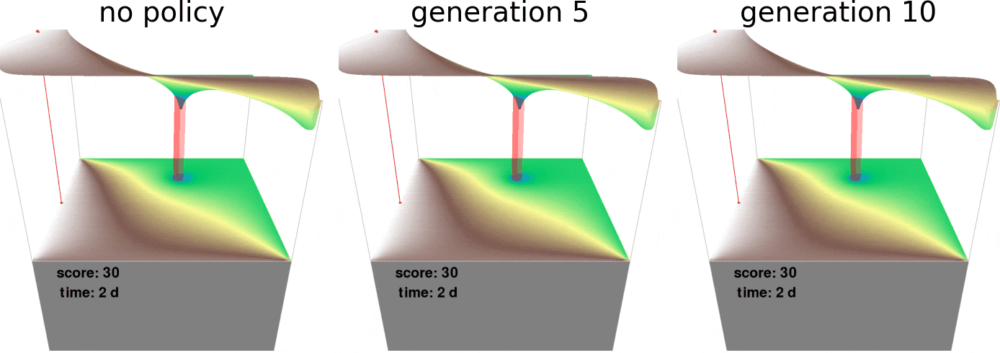
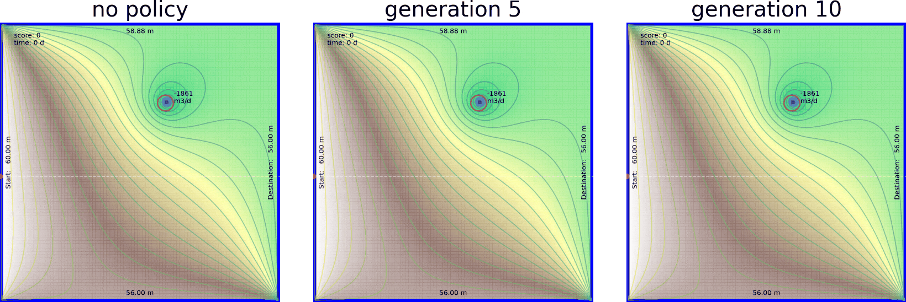
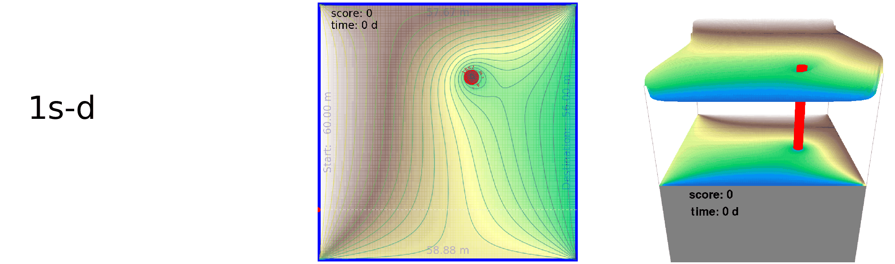
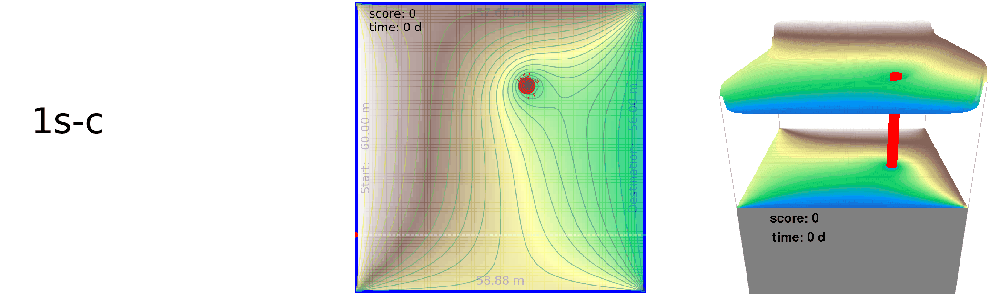
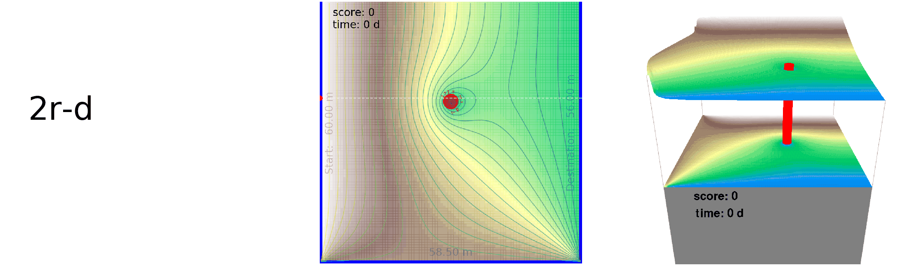
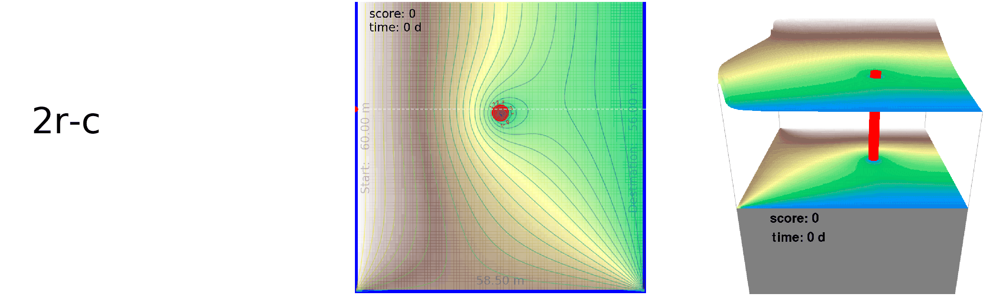
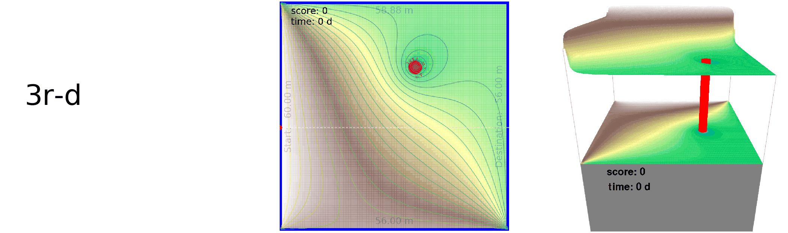

<!-- [//: <p align="center"></p>] -->


FloPyArcade provides simple [MODFLOW](https://www.usgs.gov/mission-areas/water-resources/science/modflow-and-related-programs?qt-science_center_objects=0#qt-science_center_objects)-powered groundwater arcade-type simulation environments. It builds on the functionality of [FloPy](https://github.com/modflowpy/flopy/), empowering pre- and postprocessing of MODFLOW and its related software. The idea is to provide benchmarking environments and examples to the groundwater community that allow experimenting with algorithms in search of optimal control.

[](https://travis-ci.org/philipphoehn/FloPyArcade)
[](https://mybinder.org/v2/gh/philipphoehn/FloPyArcade/master)
[](https://gitter.im/FloPyArcade/community)
[](https://www.python.org/)
[](https://codecov.io/gh/philipphoehn/FloPyArcade)
[](https://badge.fury.io/gh/philipphoehn%2Fflopyarcade)



Examples of machine-controlled actions taken in the same environment by the highest-scoring agent of genetic optimization after various generations.

Why this matters, in a nutshell: What is encapsulated in a game here, can be envisioned to be a real-world operation of an arbitrary groundwater system given a model (ensemble). You can similarly optimize and test policy models, e.g. for real-time operation of your sites.

Too late, with the peak of arcade games a few decades ago, you would think? Obviously. But they received renewed interest with the advent of [OpenAI Gym](https://gym.openai.com/) enabling to score past human performance with reinforcement learning. FloPyArcade offers a set of simple simulated groundwater flow environments, following their [style of environments](https://gym.openai.com/envs/#atari). They allow to experiment with existing or new reinforcement learning algorithms to find e.g. neural networks that yield optimal control policies. Two common learning algorithms are readily provided. Many more are and become available throughout the reinforcement learning community. Try and train for yourself. Adding your own simulation environment of arbitrary complexity with your own controls or your own using optimization algorithm is possible.

Try yourself:

The objective is to safely transport a virtual particle as it follows advection while travelling from a random location at the western boundary to the eastern boundary. You have to protect a well from capturing this particle. The well is randomly located with a random pumping rate. Furthermore, the particle must not flow into cells of specified head in the north and south. The controls you have depend on the environment, but are in total the up/down/left/right key. They allow you to either adjust specified head(s) or the well location. The highest score is achieved if the particle stays on the indicated shortest route, or as close as possible to it.

## Game (compiled for Windows)

Easily test yourself: Steer the existing environments on Windows. Skip installation by downloading these versions:

[](http://www.groundwaterautopilot.com/static/download/FloPyArcadeENV1.zip)
[](http://www.groundwaterautopilot.com/static/download/FloPyArcadeENV2.zip)
[](http://www.groundwaterautopilot.com/static/download/FloPyArcadeENV3.zip)

## Installation

Given [TensorFlow](https://www.tensorflow.org/)'s current compatibility, this project works with [Python 3](https://www.python.org/), tested up to version 3.7. 
The installation is a 2-step procedure:

1) To install all dependencies, create a directory and clone the master branch into it. The package manager [pip](https://pip.pypa.io/en/stable/) can then install them:

```bash
git clone -b master https://github.com/philipphoehn/FloPyArcade.git .
pip install -r requirements.txt
```

2) For the environment-driving simulations to function, [MODFLOW2005](https://www.usgs.gov/software/modflow-2005-usgs-three-dimensional-finite-difference-ground-water-model) and [MODPATH]() need to be compiled on your system - either in a subdirectory named simulators or with the installation paths specified as variables when using FloPyArcade. This can easily be achieved across operating systems using [pymake](https://github.com/modflowpy/pymake). While still in the main project directory, create a subdirectory "simulators" and navigate to it. Then, follow pymake's instructions (possibly you have to point to the full path of make_mf2005.py and make_modpath6.py):

```bash
pip install https://github.com/modflowpy/pymake/zipball/master
git clone https://github.com/modflowpy/pymake.git .
python examples/make_mf2005.py
python examples/make_modpath6.py
```

Alternatively: With dependencies on compiled simulators, deployment is recommended and easier in a Docker container. Create a directory first, navigate to it and build the container:

```bash
docker build -t flopyarcade --no-cache -f Dockerfile .
```

## Environments

Seven environments are currently included, three of which can be user-controlled in a game. However, groundwater environments of arbitrary complexity can be implemented, if the desired opimization target(s) can be obtained from the simulation. Feel free to modify. Currently, they can be changed with the ENVTYPE variable, ranging from '0' to '6' - with '1', '2' and '3' allowing for user control. Add 's' for non-moving or 'r' for moving boundaries and '-d' for discrete (only for '1' to '3') or '-c' for continuous actions to be taken. An example ENVTYPE variable would then be '2r-d' or '6s-c'.

Examples of human actions taken on a keyboard: Environment 1 (left) allows to adjust the northern and southern specified heads synchronously. Environment 2 (center) allows to adjust the southern specified heads. Environment 3 (right) allows to move the pumping well.













## Optimization

Two algorithms are currently provided along with the environments for training deep neural networks as policy models. These are implementions of (1) [double Q-learning](https://arxiv.org/abs/1509.06461) and (2) a weights-evolving [genetic algorithm](https://arxiv.org/abs/1712.06567), optionally combined with a simple implementation of [novelty search](https://arxiv.org/abs/1304.3362) to help avoiding convergence towards local minima. They reside in the FloPyAgent class.

The environment formulation allows for models, controls and objectives of arbitrary complexity. Modifications or more complex environments can easily be implemented with small changes to the code.

## Usage

There are main files, that can be called as follows:
1) FloPyArcadePlay.py allows to simulate an environment with (1) manual control from keystrokes or (2) control from a given policy model located in the models subfolder.

```bash
python FloPyArcadePlay.py
```

2) FloPyArcadeDQN.py trains a feed-forward multi-layer (i.e. deep) neural network policy model using the Double Q-learning algorithm.

```bash
python FloPyArcadeDQN.py
```

3) FloPyArcadeGeneticNetwork.py runs a search for optimal policy models following a genetic optimization - optionally with novelty search. It allows parallel execution with multiple processes, given the number of available CPU threads by the variable NAGENTSPARALLEL.

```bash
python FloPyArcadeGeneticNetwork.py
```

If alternatively using a Docker container, calling works just similarly:

```bash
docker run -p 81:81 flopyarcade python FloPyArcadePlay.py
```

Modify settings for the environment and hyperparameters for the provided optimization algorithms at the top of the files. The underlying policy model can easily be exchanged with arbitrary [Keras](https://keras.io/)-based models by replacing the createNNModel function within the FloPyAgent class in FloPyArcade.py. A complete description of current variables and more documentation is planned.

## Notes

This project is meant to demonstrate a new avenue of applying FloPy. It is experimental and is developed only during spare time. The code is envisioned to ultimately be [PEP-8](https://www.python.org/dev/peps/pep-0008/)-compliant, but this has smaller priority than improving and optimizing functionality.

The plumbing for FloPy is currently not ideal as files need to be constantly written to disk as the only way to inject information into the process models. With the recent BMI compliance of MODFLOW 6, exchanging information with MODFLOW through memory, while it is running, will soon simplify that.

## Contributions

Pull requests and constructive disccusions are absolutely welcome. For major changes, please open an issue first to discuss what you would like to change.

This project is heavily based on [FloPy](https://github.com/modflowpy/flopy/), [TensorFlow](https://www.tensorflow.org/), [Keras](https://keras.io/), [NumPy](https://numpy.org/) and others, and I would therefore like to acknowledge all the valuable work of developers of these outstanding libraries. Furthermore, Harrison from [pythonprogramming.net](https://pythonprogramming.net/) indirectly contributed by making inspiring programming tutorials freely accessible to enthusiasts on his website and via the [sentdex YouTube channel](https://www.youtube.com/user/sentdex), as well as many posts on [towardsdatascience.com](https://towardsdatascience.com/).

Contact: [philipp.hoehn@yahoo.com](mailto:philipp.hoehn@yahoo.com)

## License

[MIT](https://choosealicense.com/licenses/mit/)
