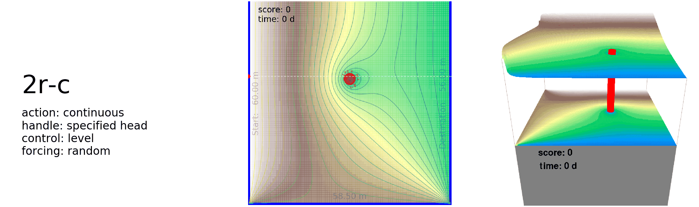

<!-- [//: <p align="center"></p>] -->

FloPyArcade provides simple [MODFLOW](https://www.usgs.gov/mission-areas/water-resources/science/modflow-and-related-programs?qt-science_center_objects=0#qt-science_center_objects)-powered groundwater arcade-type simulation environments. It builds on the functionality of [FloPy](https://github.com/modflowpy/flopy/), empowering pre- and postprocessing of MODFLOW and its related software. The idea is to provide benchmarking environments and examples to the groundwater community that allow experimenting with algorithms in search of optimal control.

[](https://travis-ci.org/philipphoehn/FloPyArcade)
[](https://mybinder.org/v2/gh/philipphoehn/FloPyArcade/master)
[](https://gitter.im/FloPyArcade/community)
[](https://www.python.org/)
[](https://codecov.io/gh/philipphoehn/FloPyArcade)
[](https://badge.fury.io/gh/philipphoehn%2Fflopyarcade)

## Installation

Install in Python 3.7+ using pip:

```bash
python -m pip install flopyarcade
```

<!---
Alternatively: With dependencies on compiled simulators, deployment is recommended and easier in a Docker container. Create a directory first, navigate to it and build the container:

```bash
docker build -t flopyarcade --no-cache -f Dockerfile .
```
-->

## See in action

See an optimized policy model in control of aquifer management.

```bash
python -m flopyarcade.train_rllib_apexdqn --playbenchmark True --envtype 3s-d
```

The environment (editable, here 3s-d) will be machine-controlled in different environment initializations, until canceled (Alt+F4). Find benchmarks comparing performance to human control below.

To control an environment yourself, for instance the 3r-d environment, use the arrow keys:

```bash
python -m flopyarcade.play --manualcontrol True --envtype 3r-d
```

## Rationale

These are example simulations from benchmarking in environment 3s-d - comparing different control agents:


Why this matters, in a nutshell: What is encapsulated in a game here, can be envisioned to be a real-world operation of an arbitrary groundwater system given a model (ensemble). You can similarly optimize and test policy models, e.g. for real-time operation of your sites.

Too late, with the peak of arcade games a few decades ago, you would think? Obviously. But they received renewed interest with the advent of [OpenAI Gym](https://gym.openai.com/) enabling to score past human performance with reinforcement learning. FloPyArcade offers a set of simple simulated groundwater flow environments, following their [style of environments](https://gym.openai.com/envs/#atari). They allow to experiment with existing or new reinforcement learning algorithms to find e.g. neural networks that yield optimal control policies. Two common learning algorithms are readily provided. Many more are and become available throughout the reinforcement learning community. Try and train for yourself. Adding your own simulation environment of arbitrary complexity with your own controls or your own optimization algorithm is possible.

## Getting started

Easily simulate an environment, for example with random actions:

```python
from flopyarcade import FloPyEnv
from numpy.random import choice

env = FloPyEnv(ENVTYPE='3s-d')
reward_total = 0.
while not env.done:
  action = choice(env.actionSpace)
  observations, reward, done, info = env.step(action)
  reward_total += reward
```

Add the following if intending to render on screen:

```python
from matplotlib.pyplot import switch_backend
switch_backend('TkAgg')

env = FloPyEnv(ENVTYPE='3s-d', flagRender=True)
```

Change to the the following if intending to simulate an environment with continuous-valued control:

```python
from numpy.random import uniform

env = FloPyEnv(ENVTYPE='6r-c')
while not env.done:
  action = uniform(low=0., high=1., size=env.actionSpaceSize)
```


## Benchmarked environments

Multiple environment variants are currently included, three of which can be user-controlled in a game. The objective is to safely transport a virtual particle as it follows advection while travelling from a random location at the western boundary to the eastern boundary. Wells have to be protected from capturing the particle. Furthermore, the particle must not flow into cells of specified head in the north and south. The controls you have depend on the environment. The highest score is achieved if the particle stays on the indicated shortest route, or as close as possible to it.

However, groundwater environments of arbitrary complexity can be implemented similarly, if the desired opimization target(s) can be obtained from the simulation. Feel free to modify. Change the ENVTYPE variable to switch between environments. Examples below list the available environments.


## Benchmarks

Below is a list of benchmarks on the simpler 1s-d, 2s-d and 3s-d environments, for 4 different types of operation:

(1) from random actions,

(2) from control through an inexperienced human,

(3) from control through an experienced human and

(4) from control a trained deep neural network as a policy model.

In these benchmarks, the optimized policy model significantly outperforms human control.


The optimization workflows for the policy models behind these benchmarks, can be reproduced using RLLib as follows:

```bash
python -m flopyarcade.train_rllib_apexdqn --envtype 3s-d --cpus 16
```

Be sure to include the intended number of cpus you wish to dedicate to this process, but not more than logical processors available. Note that RLLib generally allows distributed optimization through Ray in a compute cluster to speed things up massively. This needs manual editing of the configuration, yet is relatively straightforward. Find out more in the Ray documentation. Achieving human operation level performance here might take around 1-2 days on a state-of-the-art machine with 16 cores, as of 2021.

Note that the envtype argument is interchangeable to any provided discrete-action environment. Work to optimize continuous-valued environments using RLLib is currently in progress. Similarly, any of the many reinforcement learning libraries can be used instead. The human operation benchmark data will soon be made available for completeness.

Use TensorFlow's TensorBoard to monitor the optimization progress, if desired, by starting it and providing the logdir path (here /log/dir/path) provided by RLLib during operation:

```bash
tensorboard --logdir /log/dir/path
```

## More environments

More environments are available, yet currently remain free of benchmarks. Note: '0s-d' is an experimental environment based on MODFLOW's BMI and not yet displayed.





## Optimization

Two algorithms are currently provided along with the environments for training deep neural networks as policy models. These are implementions of (1) [double Q-learning](https://arxiv.org/abs/1509.06461) and (2) a weights-evolving [genetic algorithm](https://arxiv.org/abs/1712.06567), optionally combined with a simple implementation of [novelty search](https://arxiv.org/abs/1304.3362) to help avoiding convergence towards local minima. They reside in the FloPyAgent class.

The environment formulation allows for models, controls and objectives of arbitrary complexity. Modifications or more complex environments can easily be implemented with small changes to the code.

Examples of machine-controlled actions taken in the same environment by the highest-scoring agent of genetic optimization after various generations:


## Usage

There are main files, that can be called as follows:
1) play.py allows to simulate an environment with (1) manual control from keystrokes or (2) control from a given policy model located in the models subfolder. In the simplest environments (1s-d, 1r-d, 2s-d, 2r-d, 3s-d and 3r-d), test, for example, with manual control:

```bash
python -m flopyarcade.play --manualcontrol True --envtype 3r-d
```

2) train_dqn.py trains a feed-forward multi-layer (i.e. deep) neural network policy model using the Double Q-learning algorithm.

```bash
python -m flopyarcade.train_dqn
```

3) train_neuroevolution.py runs a search for optimal policy models following a genetic optimization - optionally with novelty search. It allows parallel execution with multiple processes, given the number of available CPU threads by the variable NAGENTSPARALLEL.

```bash
python -m flopyarcade.train_neuroevolution
```

<!---
If alternatively using a Docker container, calling works just similarly:

```bash
docker run -p 81:81 flopyarcade python FloPyArcadePlay.py
```
-->

Modify settings for the environment and hyperparameters for the provided optimization algorithms at the top of the files. The underlying policy model can easily be exchanged with arbitrary [Keras](https://keras.io/)-based models by replacing the createNNModel function within the FloPyAgent class in FloPyArcade.py. A complete description of current variables and more documentation is planned.

## Compiled game (for Windows)

Easily test yourself: Steer the existing environments on Windows. Skip installation by downloading these versions:

[](http://www.groundwaterautopilot.com/static/download/FloPyArcadeENV1.zip)
[](http://www.groundwaterautopilot.com/static/download/FloPyArcadeENV2.zip)
[](http://www.groundwaterautopilot.com/static/download/FloPyArcadeENV3.zip)

## Citing

To cite this repository in publications:

```
@misc{FloPyArcade,
  author = {Hoehn, Philipp},
  title = {FloPyArcade: Simulated groundwater environments for reinforcement learning},
  year = {2020},
  publisher = {GitHub},
  journal = {GitHub repository},
  howpublished = {https://github.com/philipphoehn/flopyarcade},
}
```

## Notes

This project is meant to demonstrate a new avenue of applying FloPy. It is experimental and is developed only during spare time. The code is envisioned to ultimately be [PEP-8](https://www.python.org/dev/peps/pep-0008/)-compliant, but this has smaller priority than improving and optimizing functionality.

The plumbing for FloPy is currently not ideal as files need to be constantly written to disk as the only way to inject information into the process models. With the recent BMI compliance of MODFLOW 6, exchanging information with MODFLOW through memory, while it is running, will soon simplify that.

## Contributions

Pull requests and constructive disccusions are absolutely welcome. For major changes, please open an issue first to discuss what you would like to change.

This project is heavily based on [FloPy](https://github.com/modflowpy/flopy/), [TensorFlow](https://www.tensorflow.org/), [Keras](https://keras.io/), [NumPy](https://numpy.org/) and others, and I would therefore like to acknowledge all the valuable work of developers of these outstanding libraries. Furthermore, Harrison from [pythonprogramming.net](https://pythonprogramming.net/) indirectly contributed by making inspiring programming tutorials freely accessible to enthusiasts on his website and via the [sentdex YouTube channel](https://www.youtube.com/user/sentdex), as well as many posts on [towardsdatascience.com](https://towardsdatascience.com/).

Contact: [philipp.hoehn@yahoo.com](mailto:philipp.hoehn@yahoo.com)

## License

[GNU GPLv3](https://choosealicense.com/licenses/gpl-3.0/)